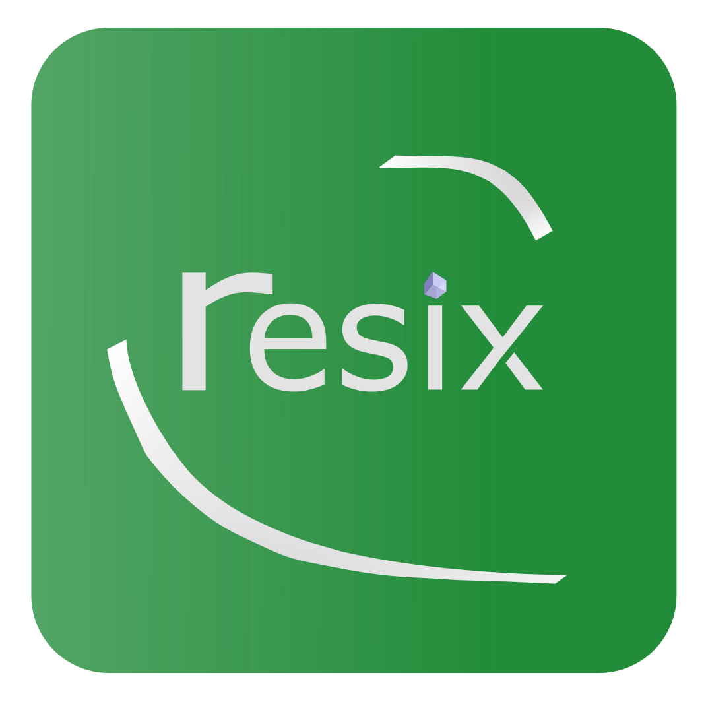

# Project Resix

## Contribute

Currently looking for developers.

Contact <xtl@xtlsoft.top> or Telegram [@xtlsoft](https://t.me/xtlsoft).

## What's this

View the announcement on Youtube: 

<iframe width="560" height="315" src="https://www.youtube.com/embed/XFnkXYqPm9A" frameborder="0" allow="accelerometer; autoplay; encrypted-media; gyroscope; picture-in-picture" allowfullscreen></iframe>

## Developer's Resources & Documents & Concepts

Currently, the docs of all the following projects will be managed at <https://dev.resix.run/resix/concepts>:

- Saphon (GitHub repository xtlsoft/Saphon)
- xpk (GitHub organization @xpkhq)
- Sert (currently no repositories)
- Gaspa (GitHub repository Sifee/Gaspa)
- Resix's central repository
- ......
